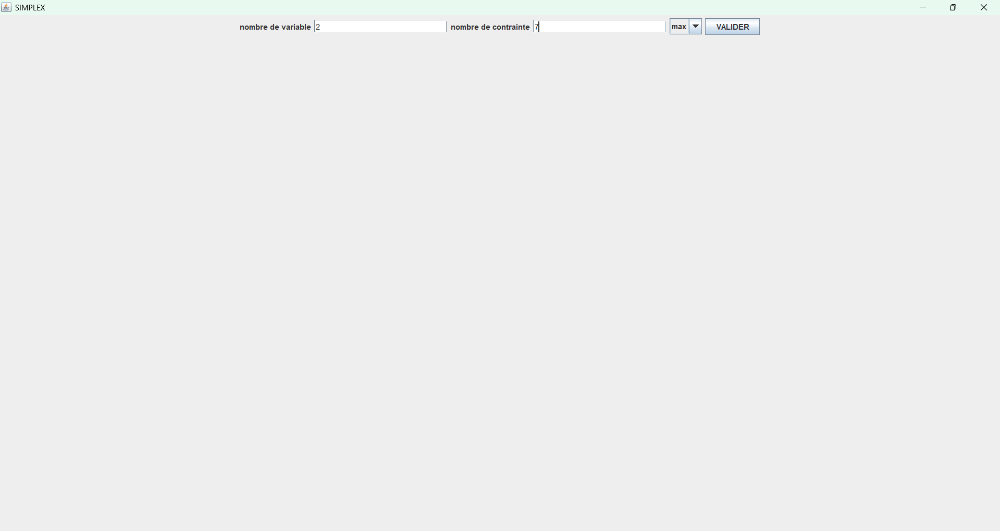
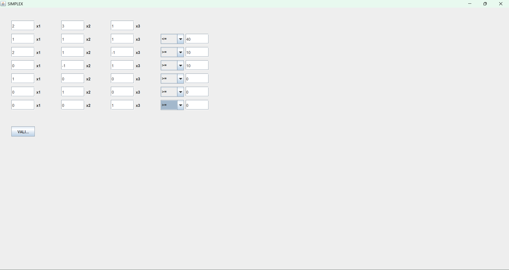
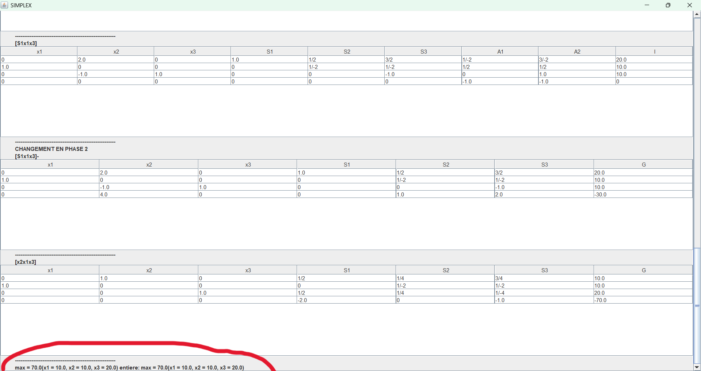
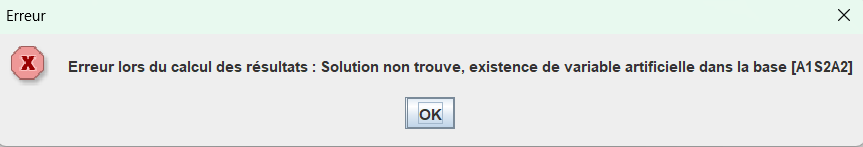

# Advanced Linear and Integer Optimization Solver  
## Simplex (One-Phase, Two-Phase) and Branch and Bound – Java

## Overview
This project is a complete optimization engine implemented in Java, designed to solve
both Linear Programming (LP) and Integer Linear Programming (ILP / PLNE) problems.

---
## Screenshots

---
## LOGS 
All dev process can be find in Process(French).md

---

## Supported Problems
The solver implements from scratch:
- The Simplex algorithm (one-phase and two-phase)
- Maximization and minimization problems
- Artificial variables and feasibility resolution
- Degeneracy handling
- Exact arithmetic using fractions
- Integer optimization using Branch and Bound
- Iteration-by-iteration Simplex tableau tracking
- A graphical user interface built with Swing

No external optimization libraries are used.

---

## Technical Stack

- Java 17
- Java Swing (Graphical User Interface)
- Object-Oriented Design

---

### Linear Programming (LP)
- Maximization and minimization of linear objective functions
- Multiple decision variables
- Multiple constraints with signs:
  - Less than or equal (≤)
  - Greater than or equal (≥)
  - Equality (=)
- Sign constraints on variables
- Automatic detection of one-phase or two-phase Simplex
- Artificial variable generation and elimination

### Integer Linear Programming (ILP / PLNE)
- Branch and Bound algorithm
- LP relaxation using the internal Simplex solver
- Automatic branching on fractional variables
- Upper bound pruning
- Infeasible branch elimination
- Selection of the best feasible integer solution

---

## Algorithms Implemented

### Simplex Method
- Tableau-based implementation
- Dynamic base management
- Entering and leaving variable validation
- Pivot selection rules
- Degeneracy detection and loop prevention
- Correct termination criteria

### Two-Phase Simplex
- Automatic feasibility detection
- Construction of the artificial objective function
- Phase 1 feasibility resolution
- Phase 2 optimization
- Removal of artificial variables
- Re-expression of the objective function using the current base

### Maximization and Minimization
- Native support for both problem types
- Mathematical equivalence used internally:

- Correct sign handling in the final result

---

## How to Run

1. Clone the repository
2. Open the project in IntelliJ IDEA or Eclipse or even VsCode
3. Run the main method in Main.java
4. Run other Main method in aff.Main.java or Aff.AffPlne.Main.java for testing;

---

## Numerical Stability

- Custom `Fraction` class with integer numerator and denominator
- Exact arithmetic to avoid floating-point accumulation errors
- Epsilon-based normalization for near-zero values
- Stable pivot operations
- Clean and consistent tableau representation

--- 

## Software Architecture

### Core Components

- **Variable**
- Name
- Type: `DECISION`, `SLACK`, `ARTIFICIAL`

- **Function**
- List of variables
- Coefficient mapping
- Evaluation methods

- **Constraint** (extends `Function`)
- Inequality sign (`≤`, `≥`, `=`)
- Right-hand side value

- **System**
- Set of variables
- Objective function
- Constraint list
- Sign constraints
- Global consistency validation

- **Base**
- Current basic variables
- Base size management

- **SimplexTable**
- Tableau representation
- Pivot index
- Iteration snapshot

- **Fraction**
- Exact rational arithmetic
- Simplification and normalization

---

## Execution Flow

1. Parse and validate the optimization system
2. Determine whether one-phase or two-phase Simplex is required
3. Build the initial Simplex tableau
4. Run Phase 1 (if required) to ensure feasibility
5. Remove artificial variables and rebuild the system
6. Run Phase 2 optimization
7. Optionally apply Branch and Bound for integer constraints
8. Output:
 - Optimal objective value
 - Optimal variable values
 - Full Simplex iteration history

---

## Graphical Interface

- Implemented using Java Swing
- Dynamic input of variables and constraints
- Clear separation between user interface and algorithm logic
- Display of intermediate and final Simplex tableaux
- Visualization of optimization results

---

## Why This Project Matters

This project demonstrates:
- Advanced algorithmic problem solving
- Deep understanding of optimization theory
- Robust object-oriented design
- Careful handling of numerical precision
- Ability to implement complex mathematical models in production-quality code

It is relevant for roles in:
- Software engineering
- Backend systems
- Optimization and operations research
- FinTech and logistics
- Scientific and engineering software development

---

## License
This project is provided for educational and demonstrational purposes.
---

## Author
ZoaraMas
